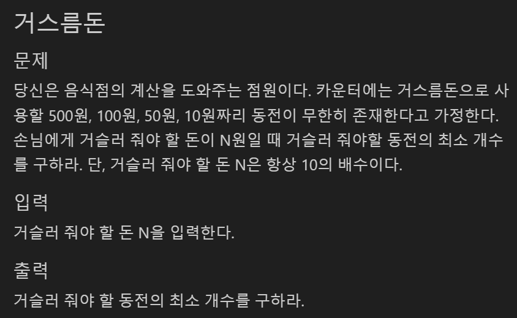

## 그리디 알고리즘(Greedy Algorithm)
- 탐욕법, 욕심쟁이 알고리즘 : 현재 상황에서 지금 당장 좋은 것만 고르는 방법
- 사전에 외우고 있지 않아도 풀 수 있는 가능성이 높은 문제 유형

### 그리디 알고리즘의 정당성
- 그리디 알고리즘으로 문제의 해법을 찾을 경우 해법이 정당한지 여부를 검토해야 함
- 탐욕적으로 문제를 접근할 때 정확한 답을 찾을 보장이 있을 경우 매우 효과적이고 직관적임
- 대부분의 문제가 그리디 알고리즘을 이용할 때 '최적의 해'를 찾을 수 없을 가능성이 많음
  - 
  - practice3-1의 경우 가지고 있는 동전 중에서 큰 단위가 항상 작은 단위의 배수이기 때문에 큰 것부터 수행
- 코딩 테스트에서 출제되는 그리디 알고리즘은 문제를 풀기 위한 최소한의 아이디어를 떠올리고 정당한지 검토 필요
- 코딩 테스트 문제를 만날 때 문제 유형을 파악하기 어려우면 그리디 알고리즘으로 먼저 접근