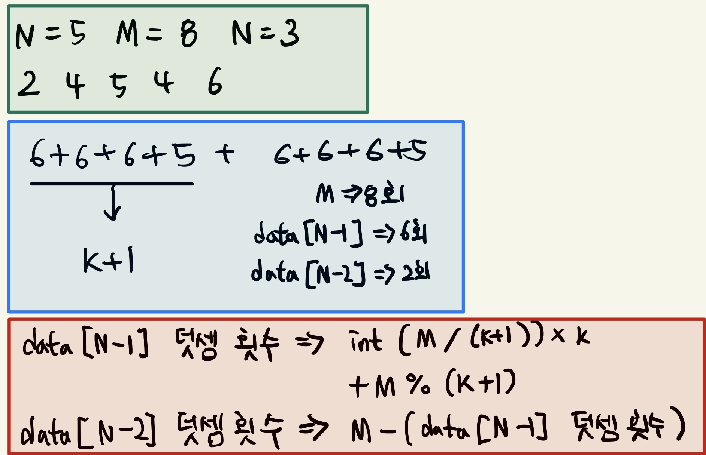

## 큰 수의 법칙
- 시간 제한 : 1초
- 메모리 제한 : 128MB
- 기출 : 2019 국가 교육기관 코딩 테스트

### 문제
이 문제에서 '큰 수의 법칙'은 큰 수의 법칙은 다양한 수로 이루어진 배열이 있을 때 주어진 수들을 M번 더하여 가장 큰 수를 만드는 법칙이다. 단, 배열의 특정한 인덱스(번호)에 해당하는 수가 연속해서 K번을 초과하여 더해질 수 없는 것이 이 법칙의 특징이다.  
예를 들어 순서대로 2, 4, 5, 4, 6으로 이루어진 배열이 있을 때 M이 8이고, K가 3이라고 가정하자. 이 경우 특정한 인덱스의 수가 연속해서 세 번까지만 더해질 수 있으므로 큰 수의 법칙에 따른 결과는 6 + 6 + 6 + 5 + 6 + 6 + 6 + 5인 46이 된다.  
단, 서로 다른 인덱스에 해당하는 수가 같은 경우에도 서로 다른 것으로 간주한다. 예를 들어 순서대로 3, 4, 3, 4, 3으로 이루어진 배열이 있을 때 M이 7이고, K가 2라고 가정하자. 이 경우 두 번째 원소에 해당하는 4와 네 번째 원소에 해당하는 4를 번갈아 두 번씩 더하는 것이 가능하다. 결과적으로 4 + 4 + 4 + 4 + 4 + 4 + 4인 28이 도출된다.  
배열의 크기 N, 숫자가 더해지는 횟수 M, 그리고 K가 주어질 때 큰 수의 법칙에 따른 결과를 출력하시오.

### 입력
첫째 줄에 N(2 <= N <= 1,000), M(1 <= M <= 10,000), K(1 <= K <= 10,000)의 자연수가 주어지며, 각 자연수는 공백으로 구분한다.  
둘째 줄에 N개의 자연수가 주어진다. 각 자연수는 공백으로 구분한다. 단, 각각의 자연수는 1 이상 10,000 이하의 수로 주어진다.
입력으로 주어지는 K는 항상 M보다 작거나 같다.

### 출력
첫째 줄에 큰 수의 법칙에 따라 더해진 답을 출력한다.

### 풀이
숫자들을 정렬하고 반복문을 통해 N-1 배열에 있는 숫자를 K번 반복해서 더해주고 한 번은 N-2 배열에 있는 숫자를 더해주면서 총 M번의 덧셈 반복 연산을 진행하였다. 책에서는 while문 True 반복문을 통해 M이 0이 될 때까지 연산하는 방식을 이용했다.


*또한 반복문 없이 하는 방식도 존재하는데, 수학적으로 접근해 반복문 없이 계산식으로 풀 수 있다는 것을 알게 되었다.
이를 통해 입력 숫자가 10,000보다 큰 수로 입력 받을 경우 여러 번의 반복문으로 발생하는 시간 초과 문제를 해결할 수 있다.  
앞으로 이러한 유형의 문제를 풀 때 먼저 수학적으로 접근해 풀이할 수 있는지 생각해봐야겠다.*
##### 나의 풀이
```python
N, M, K = map(int, input().split())
data = list(map(int, input().split()))
answer = 0
count = K

data.sort()

for i in range(M):
    if count > 0:
        count -= 1
        answer += data[N-1]
    else:
        count = K
        answer += data[N-2]

print(answer)
```

##### 교재 풀이
[practice3-2 교재 풀이](https://github.com/ndb796/python-for-coding-test/blob/master/3/2.py)