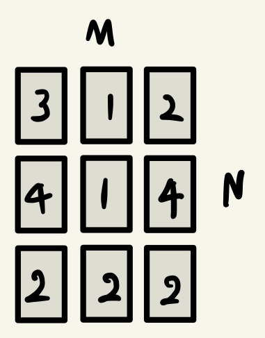

## 숫자 카드 게임
- 시간 제한 : 1초
- 메모리 제한 : 128MB
- 기출 : 2019 국가 교육기관 코딩 테스트

### 문제
숫자 카드 게임은 여러 개의 숫자 카드 중에서 가장 높은 숫자가 쓰인 카드 한 장을 뽑는 게임이다.  
단, 게임의 룰을 지키며 카드를 뽑아야 하고 룰은 다음과 같다.
1. 숫자가 쓰인 카드들이 N X M 형태로 놓여 있다. 이때 N은 행의 개수를 의미하며, M은 열의 개수를 의미한다.
2. 먼저 뽑고자 하는 카드가 포함되어 있는 행을 선택한다.
3. 그다음 선택된 행에 포함된 카드들 중 가장 숫자가 낮은 카드를 뽑아야 한다.
4. 따라서 처음에 카드를 골라낼 행을 선택할 때, 이후에 해당 행에서 가장 숫자가 낮은 카드를 뽑을 것을 고려하여 최종적으로 가장 높은 숫자의 카드를 뽑을 수 있도록 전략을 세워야 한다.

예를 들어 3 X 3 형태로 카드들이 다음과 같이 놓여 있다고 가정하자.

여기서 카드를 골라낼 행을 고를 때 첫 번쨰 혹은 두 번째 행을 선택하는 경우, 최종적으로 뽑는 카드는 1이다. 하지만 세 번째 행을 선택하는 경우 최종적으로 뽑는 카드는 2이다. 따라서 이 예제에서는 세 번째 행을 선택하여 숫자 2가 쓰여진 카드를 뽑는 것이 정답이다.
카드들이 N X M 형태로 놓여 있을 때, 게임의 룰에 맞게 카드를 뽑는 프로그램을 만드시오.

### 입력
첫째 줄에 숫자 카드들이 놓인 행의 개수 N과 열의 개수 M이 공백을 기준으로 하여 각각 자연수로 주어진다. (1 <= N, M <= 100)  
둘째 줄부터 N개의 줄에 걸쳐 각 카드에 적힌 숫자가 주어진다. 각 숫자는 1 이상 10,000 이하의 자연수이다.

### 출력
첫째 줄에 게임의 룰에 맞게 선택한 카드에 적힌 숫자를 출력한다.

### 풀이
각 줄마다 작은 수를 구하고 다음 줄에서 작은 수와 비교해 큰 수를 찾는 방식으로 이용하면 된다.

*책에서는 min() 함수를 이용해 가장 작은 수들 중 가장 큰 수를 찾는 방법과 2중 반복문 구조를 이용해 가장 작은 수들 중 가장 큰 수를 찾는 방법이 있었다. 나는 풀이할 때  min() 함수를 이용해보았다.*
##### 나의 풀이
```python
N, M = map(int, input().split())

result = 0
for i in range(N):
    data = list(map(int, input().split()))
    minNum = min(data)
    result = max(result, minNum)

print(result)
```

##### 교재 풀이
[practice3-3 교재 풀이](https://github.com/ndb796/python-for-coding-test/blob/master/3/4.py)