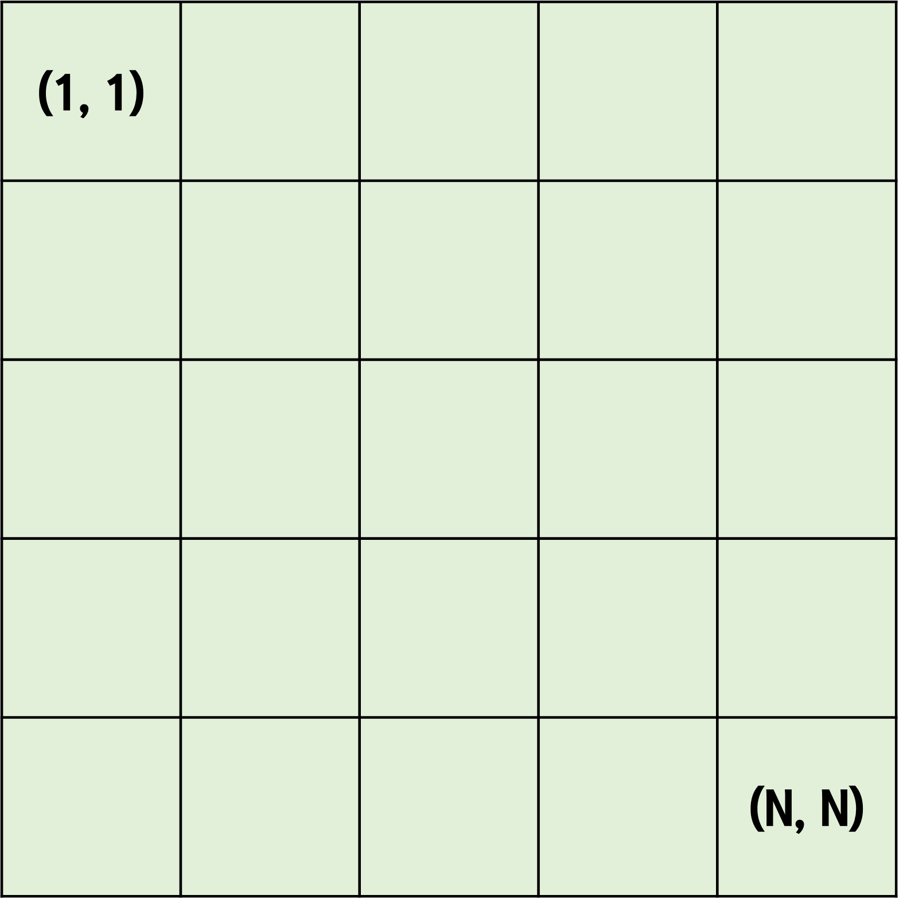

## 상하좌우
- 시간 제한 : 1초
- 메모리 제한 : 128MB

### 문제
여행가 A는 N X N 크기의 정사각형 공간 위에 서 있다. 이 공간은 1 X 1 크기의 정사각형으로 나누어져 있다. 가장 왼쪽 위 좌표는 (1, 1)이며, 가장 오른쪽 아래 좌표는 (N, N)에 해당한다. 여행가 A는 상, 하, 좌, 우 방향으로 이동할 수 있으며, 시작 좌표는 항상 (1, 1)이다. 우리 앞에는 여행가 A가 이동할 계획이 적힌 계획서가 놓여 있다.


계획서에는 하나의 줄에 띄어쓰기를 기준으로 하여 L, R, U, D 중 하나의 문자가 반복적으로 적혀있다. 각 문자의 의미는 다음과 같다.
- L : 왼쪽으로 한 칸 이동
- R : 오른쪽으로 한 칸 이동
- U : 위로 한 칸 이동
- D : 아래로 한 칸 이동

이 때 여행가 A가 N X N 크기의 정사각형 공간을 벗어나는 움직임은 무시된다. 예를 들어 (1, 1)위치에서 L 혹은 U를 만나면 무시된다.
계획서가 주어졌을 때 여행가 A가 최종적으로 도착할 지점의 좌표를 출력하는 프로그램을 작성하시오

### 입력
첫째 줄에 공간의 크기를 나타내는 N이 주어진다. (1 <= N <= 100)  
둘째 줄에 여행가 A가 이동할 계획서 내용이 주어진다. (1 <= 이동 횟수 <= 100)

### 출력
첫째 줄에 여행가 A가 최종적으로 도착할 지점의 좌표 (X, Y)를 공백으로 구분해 출력한다.

### 풀이
방향과 이동 거리를 리스트로 설정했다.
이동할 계획서 내용에 따른 방향 리스트 인덱스를 반환해 이동 거리 인덱스로 넣어 다음 이동할 거리로 하였다.
그리고 정사각형 공간을 벗어나지 않으면 x, y과 다음 이동할 거리 연산을 진행하였다.
##### 나의 풀이
```python
N = int(input())
plans = list(input().split())

x, y = 1, 1
direction = ["L", "R", "U", "D"]
distance = [(0, -1), (0, 1), (-1, 0), (1, 0)]

for plan in plans:
    nx, ny = distance[direction.index(plan)]
    if x + nx < 1 or x + nx >= N or y + ny < 1 or y + ny >= N:
        continue
    else:
        x += nx
        y += ny

print(x, y)
```

##### 교재 풀이
[practice4-1 교재 풀이](https://github.com/ndb796/python-for-coding-test/blob/master/4/1.py)